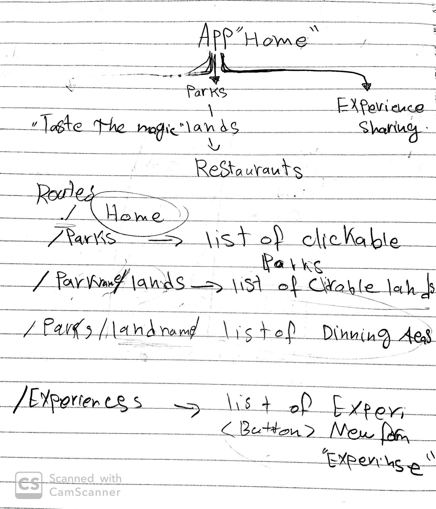
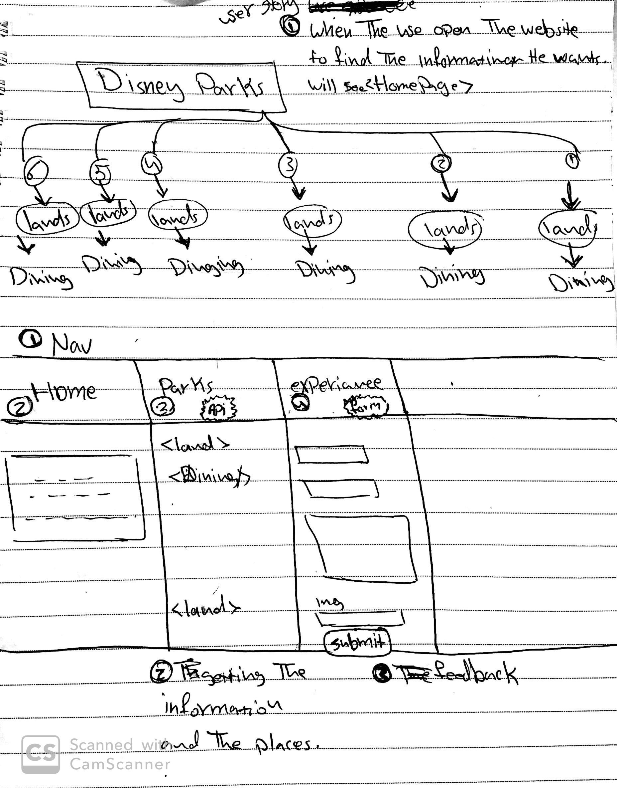
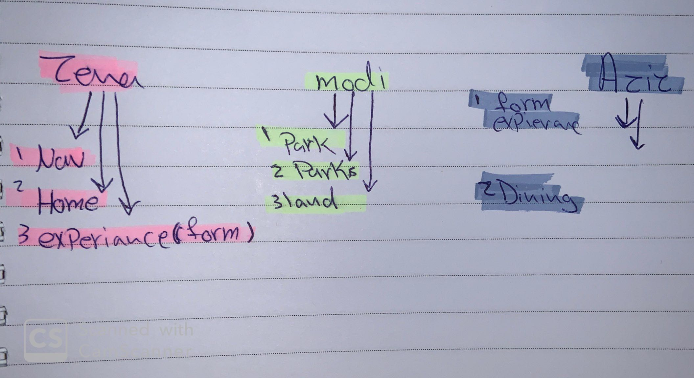

# README


# Taste the Magic
This project is basically a react based website that shows restaurents around disneyworld orlando, in addition to people posting there own experiences and images.
## Our Project Deployment
https://sei-thenet.github.io/project-3-second
## Technologies used in the project
1. JavaScript
2. React
3. Bootstrap
4. JSX and axios

## wireframes and user stories.





1. The user should be able to view the parks in orlando.
2. The user should be able to click on any park he likes and a list of lands should appear.
3. The user should be able to click on the land he likes and a list of restaurants .
4. The user should be able to post his experience .
5. the user will be able to view posted experiences .

## Planning and Development Process

### day1
wireframe and userstory and team planning, we started with the website as well
### day2
worked on the APIs ,read the documentation and tried them out.
### day3
improved our css styling and making sure its resposive
### day4
adding extra features and more styling, recorded the video .

# Describe any lines or function in the code
```js

  componentDidMount() {
    // axios
axios.get(`https://disneyparksapi.firebaseio.com/.json`)
.then(res => {
let parks = res.data.orlando.parks;
parks = parks.filter(par => parks.indexOf(par)<4);
this.setState({ parks });
})
} 
```
this code retrives data from four the api and filters the parks the doesnt have a land.